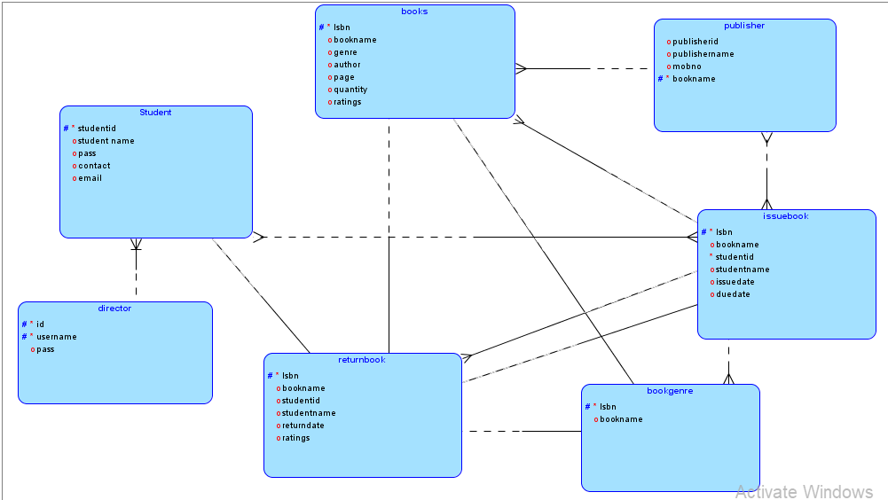
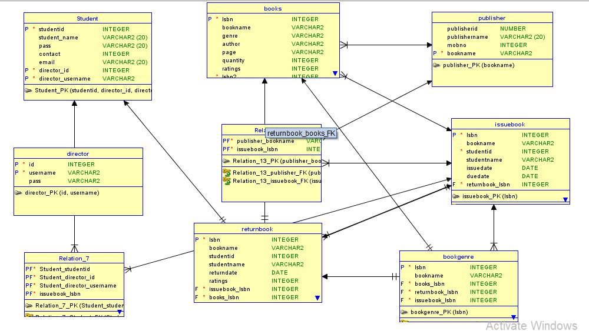

<div align="center">

# 📚 Library Management System — Java

**A full-featured desktop application for managing library operations, built with Java Swing and Oracle Database.**


</div>

---

## 📖 Table of Contents

- [About the Project](#-about-the-project)
- [Technologies Used](#-technologies-used)
- [Project Structure](#-project-structure)
- [Features](#-features)
- [Database Design](#-database-design)
- [Application Workflow](#-application-workflow)
- [Prerequisites](#-prerequisites)
- [Database Setup](#-database-setup)
- [How to Build & Run](#-how-to-build--run)
- [Screenshots](#-screenshots)
- [Future Improvements](#-future-improvements)

---

## 🔍 About the Project

This **Library Management System** is a desktop GUI application designed for educational institutions to manage their library operations efficiently. It provides separate dashboards for **Admins** and **Students**, enabling seamless management of books, student memberships, book issuance/return tracking, and review collection.

The application demonstrates core concepts of:
- **Object-Oriented Programming** in Java
- **JDBC** for relational database connectivity
- **Swing GUI** development with the NetBeans GUI Builder
- **CRUD operations** on a normalized Oracle database

> 📄 A detailed project report is also included: [`Library management rep-java.pdf`](Library%20management%20rep-java.pdf)

---

## 🛠 Technologies Used

| Layer | Technology | Purpose |
|:---:|:---|:---|
| **Language** | Java 21+ (JDK) | Core application logic |
| **GUI Framework** | Java Swing (NetBeans GUI Builder) | Desktop user interface |
| **Database** | Oracle Database XE / 21c | Persistent data storage |
| **Connectivity** | JDBC (`ojdbc8.jar`) | Java ↔ Oracle communication |
| **Date Picker** | JCalendar (`jcalendar-1.4.jar`) | Calendar widget for date fields |
| **Table Utility** | `rs2xml.jar` | Convert `ResultSet` → Swing `JTable` |
| **Build Tool** | Apache Ant | Compile, package, and run |
| **IDE** | Apache NetBeans | Project development and form design |

---

## 📁 Project Structure

```
Library-Management---Java/
│
├── main/                              # NetBeans Project Root
│   ├── src/min/                       # Java Source Files
│   │   ├── Min.java                   #   Entry point
│   │   ├── loginn.java                #   Login screen (Admin / Student)
│   │   ├── signup.java                #   Student registration form
│   │   ├── home.java                  #   Admin dashboard
│   │   ├── shome.java                 #   Student dashboard
│   │   ├── addbooks.java             #   Add new books to the catalogue
│   │   ├── managebooks.java          #   Update / delete existing books
│   │   ├── issue.java                 #   Issue a book to a student
│   │   ├── returnbook.java           #   Return a book & submit rating
│   │   ├── search.java               #   Search books (with avg ratings)
│   │   ├── student.java              #   View all registered students
│   │   ├── review.java               #   Submit a book review
│   │   └── records.java              #   View issue / return history
│   ├── build.xml                      # Ant build script
│   └── nbproject/                     # NetBeans configuration
│
├── ER diagram/                        # Database design artifacts
├── Library management rep-java.pdf    # Project report
├── *.png                              # Application screenshots
└── README.md                          # This file
```

---

## ✨ Features

### 👤 User Management
- **Dual-role login** — Admins and Students have separate authentication and dashboards.
- **Student registration** — New students can sign up with name, password, contact, and email.
- **View all students** — Admin can browse all registered members in a searchable table.

### 📕 Book Management
- **Add books** — Insert new titles with ISBN, book name, author, genre, page count, and quantity.
- **Manage books** — Edit or delete book records directly from an interactive table.
- **Search catalogue** — Search by book name or ISBN; results include average user ratings.

### 📋 Issue & Return
- **Issue books** — Admin selects a student and a book, picks issue/due dates, and creates the loan record. The book quantity is decremented automatically.
- **Return books** — Students return books by entering their details; the quantity is restored and a rating is collected.
- **Transaction records** — Full history of all issued and returned books for auditing.

### 📊 Dashboard & Analytics
- **Admin dashboard** — Displays total books, issued books, registered students, and available books at a glance.
- **Student dashboard** — Shows personalized stats and available books ordered by rating.

### ⭐ Reviews & Ratings
- **Submit reviews** — Students provide feedback after returning a book.
- **Average ratings** — The search page computes and displays the average rating for each book.

---

## 🗄 Database Design

The application uses an Oracle relational database with the following tables:

| Table | Columns | Description |
|:---|:---|:---|
| **books** | `isbn` (PK), `bookname`, `genre`, `author`, `page`, `quantity`, `rating` | Book catalogue |
| **newstudent** | `studentid` (PK), `studentname`, `password`, `contact`, `email` | Registered students |
| **issue** | `isbn`, `bookname`, `studentid`, `studentname`, `issuedate`, `duedate` | Active loans |
| **returnbook** | `isbn`, `bookname`, `studentid`, `studentname`, `returndate`, `ratings` | Return records with ratings |
| **admin** | `name`, `pass` | Admin credentials |
| **review** | _isbn_, _bookname_, _studentid_, _studentname_, _review text_ | Book reviews |

### ER Diagram

<div align="center">

</div>

### Database Schema

<div align="center">

</div>

---

## 🔄 Application Workflow

Below is the high-level flow of the application:

```
                          ┌──────────────────┐
                          │   Login Screen    │
                          │  (loginn.java)    │
                          └────────┬─────────┘
                                   │
                     ┌─────────────┴─────────────┐
                     ▼                           ▼
           ┌─────────────────┐         ┌─────────────────┐
           │  Admin Dashboard │         │ Student Dashboard│
           │   (home.java)   │         │  (shome.java)   │
           └────────┬────────┘         └────────┬────────┘
                    │                           │
        ┌───────┬──┴──┬────────┐       ┌───────┼────────┐
        ▼       ▼     ▼        ▼       ▼       ▼        ▼
   ┌────────┐┌──────┐┌──────┐┌──────┐┌──────┐┌──────┐┌──────┐
   │  Add   ││Manage││Issue ││View  ││Search││Return││Review│
   │ Books  ││Books ││Books ││Records││Books ││Books ││Books │
   └────────┘└──────┘└──────┘└──────┘└──────┘└──────┘└──────┘
```

**Step-by-step process:**

1. **Login** — The user opens the application and is presented with a login screen. They select their role (Admin or Student) and enter their credentials.
2. **Admin Flow:**
   - View the **dashboard** with summary statistics.
   - **Add books** to the library catalogue by filling in the book details form.
   - **Manage books** — view all books in a table, select a row to update or delete.
   - **Issue a book** — choose a student and a book, set issue and due dates.
   - **View students** — browse all registered members.
   - **View records** — check the history of issued and returned books.
3. **Student Flow:**
   - **Sign up** for a new account (if not already registered).
   - View the **student dashboard** with personal stats and available books.
   - **Search** the catalogue by name or ISBN, with average ratings displayed.
   - **Return a book** — enter book and student details; a rating prompt appears.
   - **Submit a review** — provide written feedback on a borrowed book.

---

## ⚙ Prerequisites

Before running the application, make sure you have the following installed:

| Requirement | Version | Notes |
|:---|:---|:---|
| **Java JDK** | 21 or higher | [Download from Oracle](https://www.oracle.com/java/technologies/downloads/) or use OpenJDK |
| **Oracle Database** | XE or 21c | Running on `localhost:1521` with SID `xe` |
| **Apache NetBeans** | Latest | Recommended IDE for GUI form editing |
| **Apache Ant** | (bundled with NetBeans) | Required only for command-line builds |

### Required JAR Libraries

These JARs must be on the project classpath (already configured in the NetBeans project):

| Library | File | Purpose |
|:---|:---|:---|
| Oracle JDBC Driver | `ojdbc8.jar` | Database connectivity |
| JCalendar | `jcalendar-1.4.jar` | Date picker UI component |
| rs2xml | `rs2xml.jar` | ResultSet → JTable conversion |

---

## 🗃 Database Setup

Create the required tables in your Oracle database. Connect to Oracle as a database user and run:

```sql
-- 1. Books table
CREATE TABLE books (
    isbn       VARCHAR2(20) PRIMARY KEY,
    bookname   VARCHAR2(100),
    genre      VARCHAR2(50),
    author     VARCHAR2(100),
    page       NUMBER,
    quantity   NUMBER,
    rating     NUMBER
);

-- 2. Students table
CREATE TABLE newstudent (
    studentid    VARCHAR2(20) PRIMARY KEY,
    studentname  VARCHAR2(100),
    password     VARCHAR2(50),
    contact      VARCHAR2(20),
    email        VARCHAR2(100)
);

-- 3. Admin table
CREATE TABLE admin (
    name  VARCHAR2(50),
    pass  VARCHAR2(50)
);

-- 4. Issue records table
CREATE TABLE issue (
    isbn         VARCHAR2(20),
    bookname     VARCHAR2(100),
    studentid    VARCHAR2(20),
    studentname  VARCHAR2(100),
    issuedate    VARCHAR2(30),
    duedate      VARCHAR2(30)
);

-- 5. Return records table
CREATE TABLE returnbook (
    isbn         VARCHAR2(20),
    bookname     VARCHAR2(100),
    studentid    VARCHAR2(20),
    studentname  VARCHAR2(100),
    returndate   VARCHAR2(30),
    ratings      NUMBER
);

-- 6. Reviews table
CREATE TABLE review (
    isbn         VARCHAR2(20),
    bookname     VARCHAR2(100),
    studentid    VARCHAR2(20),
    studentname  VARCHAR2(100),
    review       VARCHAR2(500)
);

-- Insert a default admin user
INSERT INTO admin VALUES ('admin', 'admin123');
COMMIT;
```

> **⚠️ Note:** Update the JDBC connection string in the source files if your Oracle configuration differs from the default (`localhost:1521:xe`).

---

## 🚀 How to Build & Run

### Option 1 — Using NetBeans (Recommended)

1. Open **Apache NetBeans**.
2. Go to **File → Open Project** and select the `main/` folder.
3. Ensure the required JAR libraries (`ojdbc8.jar`, `jcalendar-1.4.jar`, `rs2xml.jar`) are added to the project's **Libraries**.
4. Make sure your Oracle database is running and the tables are created.
5. Right-click the project → **Run**.

### Option 2 — Using Ant (Command Line)

```bash
# Navigate to the project directory
cd main/

# Clean and build the project
ant clean
ant build

# Run the application
ant run
```

### Option 3 — Using Java Directly

```bash
# Navigate to the build output directory
cd main/build/classes

# Run with required JARs on the classpath
java -cp ".;path/to/ojdbc8.jar;path/to/jcalendar-1.4.jar;path/to/rs2xml.jar" min.Min
```

> **💡 Tip:** Replace `path/to/` with the actual paths to your JAR files. On Linux/macOS, use `:` instead of `;` as the classpath separator.

---

## 📸 Screenshots

### 🔐 Login Screen
The entry point of the application. Users select their role (Admin or Student) and authenticate.

<div align="center">

</div>

### 📝 Student Sign-Up
New students register by providing their ID, name, password, contact number, and email.

<div align="center">

</div>

### 🏠 Admin Dashboard
A summary view showing total books, issued count, registered students, and available books.

<div align="center">

</div>

### ➕ Adding a New Book
Admin fills in the book details — ISBN, name, author, genre, pages, and quantity — to add it to the catalogue.

<div align="center">

</div>

### 💾 Book Saved Successfully
Confirmation dialog shown after a new book is added to the database.

<div align="center">

</div>

### 📋 Managing Books — Table View
All books displayed in a JTable. Admin can select a row to update or delete.

<div align="center">

</div>

### ✏️ Managing Books — Edit & Delete
Admin edits book details inline or removes a book from the catalogue.

<div align="center">

</div>

### 📤 Issuing a Book
Admin selects a student and a book, then sets the issue and due dates using the calendar picker.

<div align="center">

</div>

### 📤 Issue — Selecting Details
Dropdown selections and date pickers help the admin fill in the issue form accurately.

<div align="center">

</div>

### ✅ Book Issued Successfully
Confirmation that the book has been issued and the quantity has been updated.

<div align="center">

</div>

### 📥 Returning a Book
Student enters their ID and the book ISBN to process a return. A rating prompt is shown.

<div align="center">

</div>

### ✅ Book Returned Successfully
Confirmation that the return was processed and the book quantity was restored.

<div align="center">

</div>

### 🔍 Searching Books
Search the catalogue by book name or ISBN. Results are displayed with average ratings.

<div align="center">

</div>

### ⚠️ Alert / Validation
Example of an alert dialog for validation or informational messages.

<div align="center">

</div>

---

## 🚀 Future Improvements

- [ ] **Externalize configuration** — Move database credentials to a `.properties` file or environment variables.
- [ ] **Use a dedicated DB user** — Replace the `system` account with a restricted application-specific user.
- [ ] **Add SQL creation scripts** — Include ready-to-run scripts so new users can set up the database instantly.
- [ ] **Separate concerns** — Move business logic out of GUI classes into service/DAO layers.
- [ ] **Add unit tests** — Cover loan rules, availability checks, and input validation.
- [ ] **Password hashing** — Store passwords using bcrypt or a similar hashing algorithm.
- [ ] **Connection pooling** — Use HikariCP or similar for better performance.
- [ ] **Embedded DB option** — Support H2 or SQLite for easy local testing without Oracle.
- [ ] **Input validation & error handling** — Add proper validation and user-friendly error messages.
- [ ] **Logging** — Replace `printStackTrace()` with a logging framework (e.g., SLF4J/Logback).

---

<div align="center">

**Made with ❤️ in Java**

</div>
